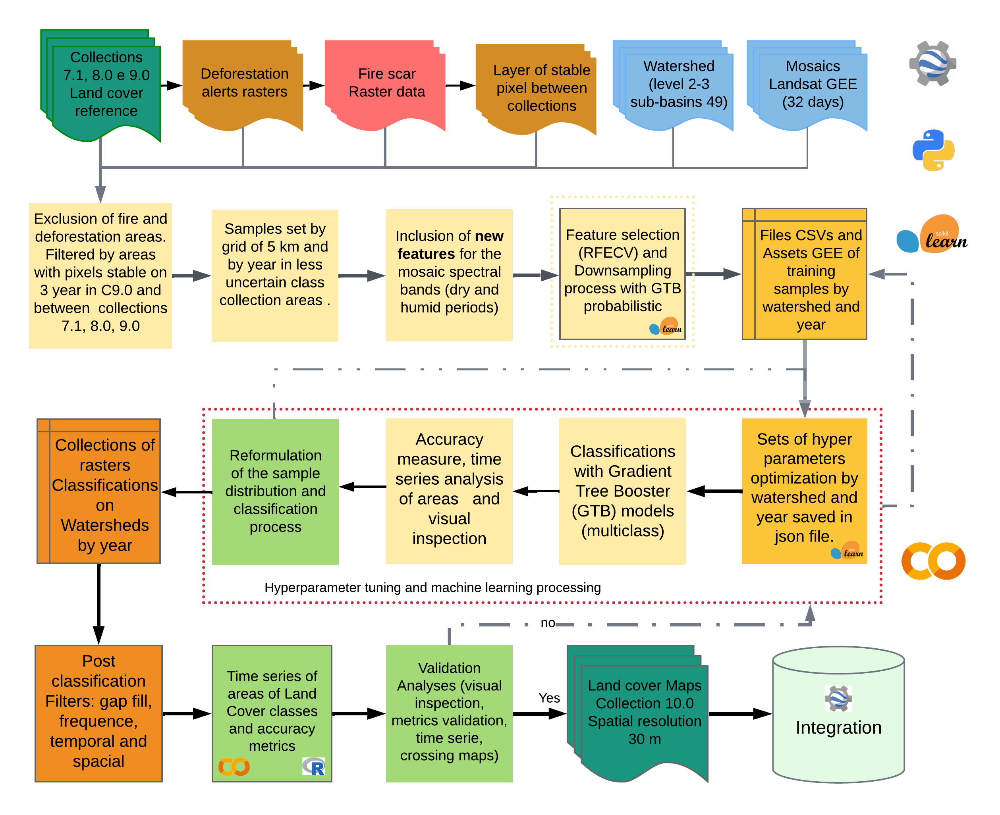
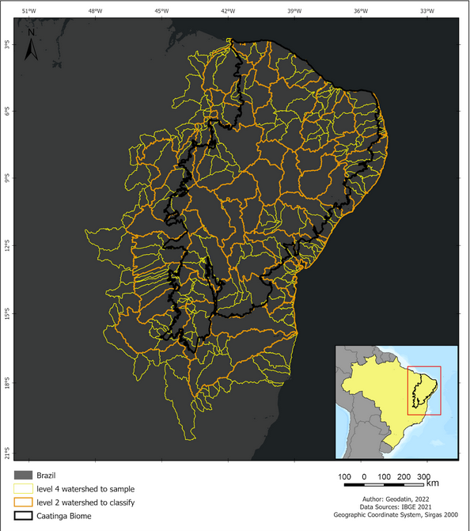

# Land Use and Land Cover Mapping Project - Caatinga Biome — Collection 11

This repository contains the complete workflow and scripts used for the annual mapping of land use and land cover in the Caatinga biome (Collection 11). The process is based on remote sensing techniques, utilizing the **Google Earth Engine (GEE)** platform and **Machine Learning** algorithms to classify Landsat satellite imagery at **30 m** spatial resolution, covering the full time series from **1985 to 2025** (41 years).

The project is organized into five main stages: sample collection, feature selection, hyperparameter tuning, classification, and post-classification filtering.

## Methodological Flowchart

The process flow diagram utilized in Collection 11.0 of the Caatinga biome is depicted in Figure 1. This flowchart consolidates each stage's key procedures, which were improved in this most recent collection. Generally speaking, the following procedures are involved in creating the land cover and land use maps in the Caatinga Biome: data input, sample collection, feature selection, hyperparameter tuning, classification models, post-classification filters, validation and visual inspection, and integration with MapBiomas.

<p align="center">
  
</p>
<p align="center">Figure 1. Simplified general flowchart.</p>

</br>

For further details, some improvements were added and are described below (Figure 2).

<p align="center">
  
</p>
<p align="center">Figure 2. Classification process of MapBiomas Collection 11.0 (1985–2025) in the Caatinga biome.</p>


## Classification Target Classes

Collection 11.0 maps **10 land cover/use classes** in the Caatinga biome:

| Code | Class                        |
|------|------------------------------|
| 3    | Forest Formation             |
| 4    | Savanna Formation            |
| 12   | Grassland / Campestre        |
| 15   | Pasture                      |
| 19   | Annual and Perennial Crops   |
| 21   | Mosaic of Agriculture        |
| 25   | Non-Vegetated Area           |
| 29   | Rocky Outcrop                |
| 33   | Water Body                   |
| 36   | Irrigated Agriculture        |


## Workflow Stages

The workflow is organized into five major stages, each contained in its respective folder within the repository.

---

### 1. Sample Data Collection (`src/samples_process`)

The collection of sample data (ROIs — Regions of Interest) forms the foundation for training the models. To optimize the process over a large area like the Caatinga, the biome was divided into **756 grids**, which are based on **49 hydrographic regions**.

<p align="center">
  
</p>
<p align="center">Figure 3. Watershed basins used in the classification and sampling of the MapBiomas LULC collections for Caatinga biome.</p>

The collection areas are refined through a filter that uses exclusion layers to ensure sample quality, removing areas with deforestation alerts, burn scars, and inconsistencies between different data collections.

**Improvements in Collection 11:**
- `colect_ROIsAgrWat_fromGrade_with_Spectral_info.py` — specialized ROI collection for agricultural and water classes, using **Collection 10** (`assetMapbiomas100`) as the agreement mask.
- `colect_ROIs_from_ROIsEE_with_Spectral_info.py` — collects ROIs directly from existing GEE assets, enabling faster re-collection in regions with insufficient samples.
- `exportRoi.py` — exports consolidated ROI batches to GEE assets.
- `merge_rois_from_Grade_Basin_to_bacias.py` — merges individual grid ROIs into basin-level feature collections.

**Relevant Scripts:**
* `colect_ROIsAgrWat_fromGrade_with_Spectral_info.py`
* `colect_ROIs_from_ROIsEE_with_Spectral_info.py`
* `merge_rois_from_Grade_Basin_to_bacias.py`
* `exportRoi.py`

---

### 2. Feature Analysis and Variable Selection (`src/features_process`)

In this stage, the objective is to identify which of the hundreds of calculated spectral bands and indices are most relevant for classification, avoiding redundancy and improving model performance.

**RFECV** (Recursive Feature Elimination with Cross-Validation, implemented via `scikit-learn`) is used to rank the most important variables. A correlation filter removes less important variables that are strongly correlated with others.

**Improvements in Collection 11:**
- `resample_cleaning_ROIsBasin.py` — applies spectral-similarity-based resampling to remove noisy samples within each basin, using binary class group dictionaries (`dictRemap`) and `StratifiedKFold` cross-validation to select the most representative samples.
- `resamples_balances_ROIs.py` — balances the sample set per class group (vegetation, agropecuaria, non-vegetated) using configurable per-class limits (`quant_PtosxClass`), improving model stability in under-represented classes.
- `downsamples_cleaning_ROIsBasin.py` / `downsamples_cleaning_ROIsBasin_v2.py` — iterative downsampling procedures to reduce class imbalance before feature selection.
- `feature_selection_REFCV_col11.py` — updated RFECV implementation for Collection 11, incorporating the expanded spectral feature set.
- `metricas_JM_distance.py` — computes Jeffries-Matusita separability distances between classes to guide feature selection and class merging decisions.
- `reviewer_rois_by_basin_to_train.py` — visual review tool to audit ROI distributions per basin before training.

**Relevant Scripts:**
* `featureselection_functionsV2.py`
* `feature_selection_REFCV_col11.py`
* `resample_cleaning_ROIsBasin.py`
* `resamples_balances_ROIs.py`
* `correction_class_samples_downsampled.py`
* `metricas_JM_distance.py`

---

### 3. Hyperparameter Tuning (`src/features_process` — tuning scripts)

To ensure the best possible classifier performance, a hyperparameter optimization (*tuning*) process is conducted using **HalvingGridSearchCV** from `scikit-learn`. This script systematically tests various combinations of GTB (Gradient Tree Boost) parameters for each basin and year. The combination that yields the best accuracy is saved to JSON for use in the classification stage.

**Relevant Script:**
* `hyperpTuning_Halving_Grid_Search.py`

---

### 4. Classification (`src/classfication_process`)

This is the stage where the land use and land cover map is generated for each basin and year using the **GEE Python API**. The classification script loads all artifacts generated in the previous stages:

* **Geographic boundaries** of the basin.
* A JSON file with the **list of selected features** per basin.
* A JSON file with the **optimized hyperparameters** for the GTB classifier.

The script runs the trained GTB model on the Landsat mosaic for the corresponding year (source: `projects/nexgenmap/MapBiomas2/LANDSAT/BRAZIL/mosaics-2`), generating the classified image exported to:
`projects/mapbiomas-workspace/AMOSTRAS/col11/CAATINGA/Classifier/Classify_fromEEMV1`

**Improvements in Collection 11:**
- `classificacao_NotN_newBasin_Float_col10_probVC2_featMaps.py` — extended variant that also exports per-class probability maps alongside the hard classification.
- `dict_expressions.py` — centralized dictionary of spectral index expressions used by all classification scripts.
- `test_classify_single_bacia.js` — GEE JavaScript helper to visually inspect the classification result for a single basin.

**Relevant Scripts:**
* `classificacao_NotN_newBasin_Float_col10_probVC2.py`
* `classificacao_NotN_newBasin_Float_col10_probVC2_featMaps.py`
* `arqParametros_class.py`
* `dict_expressions.py`

---

### 5. Post-Classification Filters (`src/filters_process`)

After the raw GTB classification is generated, a 5-step filter pipeline removes noise and temporal inconsistencies introduced by clouds, shadows, and spectral variability in the 41-year Landsat series. The complete description of each filter is in [`src/filters_process/README_filtros.md`](src/filters_process/README_filtros.md).

<p align="center">

```
Classify_fromEEMV1joined
         │
         ▼  filtersGapFill_step1A.py           ── STEP 1: Fill missing pixels
    POS-CLASS/Gap-fill
         │
         ▼  filtersNaturalTemporal_step2A.py   ── STEP 2A: Natural temporal filter
    POS-CLASS/TemporalA
         │
         ▼  filtersAntropicTemporal_step2B.py  ── STEP 2B: Anthropic temporal filter
    POS-CLASS/Temporal
         │
         ▼  filtersSpatial_AllClass_step3A.py  ── STEP 3A: Spatial filter (all classes)
    POS-CLASS/Spatials_all
         │
         ▼  filtersSpatial_By_Cover_step3A.py  ── STEP 3B: Spatial filter (by cover)
    POS-CLASS/Spatials_int
         │
         ▼  filtersFrequency_step4A.py         ── STEP 4: Frequency-based stabilization
    POS-CLASS/Frequency
         │
         ▼  filtersTemporal_step5A.py          ── STEP 5: Final temporal filter
    POS-CLASS/TemporalCC   ← FINAL PRODUCT
```

</p>

| Step | Script | What it does |
|------|--------|-------------|
| 1 | `filtersGapFill_step1A.py` | Fills null pixels caused by clouds, shadows, and ETM+ scan-line gaps using backward-fill from Collection 10 |
| 2A | `filtersNaturalTemporal_step2A.py` | 6-year sliding window to correct 1–4 year anomalies in natural classes (direction: 2025→1985) |
| 2B | `filtersAntropicTemporal_step2B.py` | 5-year sliding window to correct isolated natural pixels in anthropic areas |
| 3A | `filtersSpatial_AllClass_step3A.py` | Replaces isolated pixels (< 12 connected pixels) with the mode of a 9×9 neighborhood |
| 3B | `filtersSpatial_By_Cover_step3A.py` | Class-pair-specific spatial filter using mode or min reducer depending on context |
| 4 | `filtersFrequency_step4A.py` | Stabilizes pixels that are 100% natural across all 41 years, assigning dominant class |
| 5 | `filtersTemporal_step5A.py` | Final 3–5 year window to remove residual 1–3 year anomalies for Forest, Savanna, and Agriculture |

**Relevant Scripts:**
* `filtersGapFill_step1A.py`
* `filtersNaturalTemporal_step2A.py`
* `filtersAntropicTemporal_step2B.py`
* `filtersSpatial_AllClass_step3A.py`
* `filtersSpatial_By_Cover_step3A.py`
* `filtersFrequency_step4A.py`
* `filtersFrequency_step4B.py`
* `filtersTemporal_step5A.py`


## Repository Structure

```
lulc_30m_landsat/collection_11/
├── README.md
└── src/
    ├── configure_account_projects_ee.py        # GEE account/project manager
    ├── gee_tools.py                             # shared GEE utility functions
    │
    ├── samples_process/                         # Stage 1 — ROI Collection
    │   ├── colect_ROIsAgrWat_fromGrade_with_Spectral_info.py
    │   ├── colect_ROIs_from_ROIsEE_with_Spectral_info.py
    │   ├── merge_rois_from_Grade_Basin_to_bacias.py
    │   ├── exportRoi.py
    │   ├── mosaicos_Landsat_GEE.js
    │   └── dict_basin_49_lista_grades.json
    │
    ├── features_process/                        # Stage 2 — Feature Selection & Resampling
    │   ├── featureselection_functionsV2.py
    │   ├── feature_selection_REFCV_col11.py
    │   ├── resample_cleaning_ROIsBasin.py
    │   ├── resamples_balances_ROIs.py
    │   ├── downsamples_cleaning_ROIsBasin.py
    │   ├── correction_class_samples_downsampled.py
    │   ├── metricas_JM_distance.py
    │   ├── reviewer_rois_by_basin_to_train.py
    │   ├── get_feature_select_fromjson.py
    │   ├── FS_col11_json/                       # per-basin feature lists
    │   └── arqParametros.py
    │
    ├── classfication_process/                   # Stage 3–4 — Tuning & Classification
    │   ├── classificacao_NotN_newBasin_Float_col10_probVC2.py
    │   ├── classificacao_NotN_newBasin_Float_col10_probVC2_featMaps.py
    │   ├── arqParametros_class.py
    │   ├── dict_expressions.py
    │   └── test_classify_single_bacia.js
    │
    ├── filters_process/                         # Stage 5 — Post-Classification Filters
    │   ├── README_filtros.md
    │   ├── filtersGapFill_step1A.py
    │   ├── filtersNaturalTemporal_step2A.py
    │   ├── filtersAntropicTemporal_step2B.py
    │   ├── filtersSpatial_AllClass_step3A.py
    │   ├── filtersSpatial_By_Cover_step3A.py
    │   ├── filtersFrequency_step4A.py
    │   ├── filtersFrequency_step4B.py
    │   └── filtersTemporal_step5A.py
    │
    └── show_mapas/                              # GEE visualization scripts
        ├── showClassification_bacias.js
        ├── show_3_years_consecutivos.js
        └── cooncordancias_cole9_col10.js
```


## Main Data Assets (GEE)

| Asset | Description |
|-------|-------------|
| `projects/nexgenmap/MapBiomas2/LANDSAT/BRAZIL/mosaics-2` | Landsat annual mosaics (1985–2025) |
| `projects/mapbiomas-workspace/AMOSTRAS/col11/CAATINGA/ROIs/ROIs_byGradesIndv2` | Per-grid ROIs |
| `projects/mapbiomas-workspace/AMOSTRAS/col11/CAATINGA/ROIs/ROIs_clean_downsamplesCCred` | Cleaned and resampled ROIs used for training |
| `projects/mapbiomas-workspace/AMOSTRAS/col11/CAATINGA/aggrements` | Agreement mask (Col10 × Col11) used for exclusion filters |
| `projects/mapbiomas-workspace/AMOSTRAS/col11/CAATINGA/Classifier/Classify_fromEEMV1` | Raw GTB classification output |
| `projects/mapbiomas-workspace/AMOSTRAS/col11/CAATINGA/POS-CLASS/TemporalCC` | Final post-filtered product |
| `projects/mapbiomas-workspace/AMOSTRAS/col9/CAATINGA/bacias_hidrografica_caatinga_49_regions` | 49 hydrographic basin boundaries |
| `projects/mapbiomas-public/assets/brazil/lulc/collection10/mapbiomas_brazil_collection10_integration_v2` | MapBiomas Collection 10 reference |


## Dependencies

* Python 3.x
* `earthengine-api`
* `scikit-learn`
* `pandas`, `numpy`
* `tqdm`, `tabulate`
* `gee_tools.py` (local utility module)


## License

Distributed under **GPLv2**. Produced by **Geodatin — Dados e Geoinformação**.
