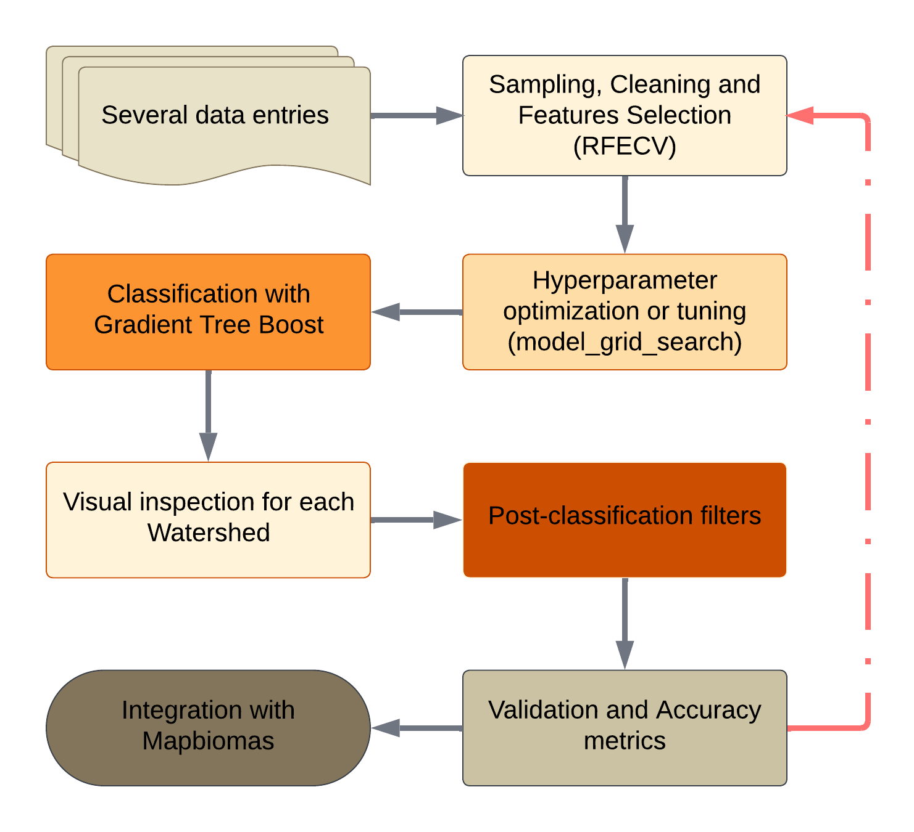
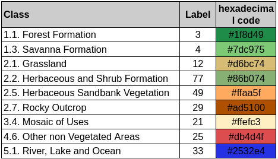

# MapBiomas Coleção 11 — Caatinga

Pipeline de classificação de **uso e cobertura da terra (LULC)** do bioma
**Caatinga** para a Coleção 11 do MapBiomas. Produz a série anual de mapas de
**1985 a 2025 (41 anos)** para **49 bacias hidrográficas**, combinando
Google Earth Engine (GEE) e scikit-learn local.

> 📄 A descrição técnica completa e fiel ao código está em
> **[`DESCRICAO_PROCESSO.md`](DESCRICAO_PROCESSO.md)** — base para o ATBD do projeto.
> Contexto permanente do assistente em [`CLAUDE.md`](CLAUDE.md).

---

## Fluxo do pipeline



| # | Etapa | Diretório | Onde roda | Produto |
|---|---|---|---|---|
| 1 | Coleta de amostras (ROIs) | `src/samples_process/` | GEE | `ROIs_byGradesIndv2` |
| 2 | Seleção + limpeza de features | `src/features_process/` | sklearn local + GEE | `feat_sel_*.json`, `ROIs_clean_downsamples*` |
| 3 | Classificação (GTB) | `src/classification_process/` | GEE | `Classify_fromEEMV1` |
| 4 | Filtros pós-classificação | `src/filter/` | GEE | `POS-CLASS/Spatials_all` |
| 5 | Integração/exportação final | `src/utieis_scripts/` | GEE | `COLLECTION-11/.../CAATINGA-{ano}-{v}` |
| 6 | Validação (acurácia + área) | `src/validation/` | GEE + pandas/sklearn | CSVs e tabelas globais |

```
Landsat 32-day ─▶ ROIs (grade 30km, rótulo Col10) ─▶ RFECV + downsampling
   ─▶ GradientTreeBoost por bacia/ano ─▶ Gap-fill ▸ Sieve ▸ Temporal J3/J4/J5
   ─▶ Frequência ▸ Spatial All ─▶ integração ─▶ validação (85k pts / área ha)
```

---

## Etapas em detalhe

Visão ampliada do processo — entradas de dados, bloco de aprendizado de
máquina/tuning de hiperparâmetros e cadeia de pós-classificação até a integração:


### 1. Coleta de amostras — `src/samples_process/`
`colect_ROIsAgrWat_fromGrade_with_Spectral_info.py` coleta ROIs **por grade de
30 km** ao longo dos 41 anos. Monta mosaicos Landsat (`LANDSAT/COMPOSITES/C02/
T1_L2_32DAY`) em três períodos (year/wet=jan–jul/dry=ago–dez), calcula ~30 índices
espectrais (+ SMA/NDFIa, slope, texturas), aplica a máscara de concordância
(`aggrements`) e rotula cada amostra pela **Coleção 10 pública** (áreas estáveis),
amostrando até 3000 px/grade/ano.
Apoio: `gerar_percentis_p01_p99_bacia_ano.py` (percentis P1/P99 por bacia/ano),
`register_parameters.py`, `README_indices_espectrais.md` (índices + DOIs).

**Como rodar** — sem argumentos (parâmetros já setados no topo do arquivo: anos
`anoIntInit/anoIntFin`, grade, `asset_output_grade`, amostragem por classe):
```bash
python src/samples_process/colect_ROIsAgrWat_fromGrade_with_Spectral_info.py

# Apoio — percentis P1/P99 (opcional: --merge / --merge-clean para consolidar)
python src/samples_process/gerar_percentis_p01_p99_bacia_ano.py
python src/samples_process/gerar_percentis_p01_p99_bacia_ano.py --merge
```

### 2. Features — `src/features_process/`
- **Seleção (sklearn local):** `feature_selection_REFCV_col11.py` — `RFECV` com
  `RandomForestClassifier(n_estimators=800)`, `StratifiedKFold(3)`, `step=0.05`,
  `min_features=15`. Saída: `FS_col11_json/feat_sel_{bacia}_{ano}.json`.
- **Limpeza + downsampling (GEE):** `resamples_balances_ROIs.py` →
  `downsamples_cleaning_ROIsBasin.py` (v1) → `_v2.py`. Balanceamento por
  **undersampling** com tetos por classe; a v1 usa GTB binário para amostrar por
  faixa de probabilidade (preserva amostras difíceis). Dataset final: `CCredv2`.
- Auditoria: `reviewer_rois_by_basin_to_train.py`.

**Como rodar** — a seleção RFECV usa **argumentos posicionais** (fatia da lista de
bacias: início e fim); os demais rodam sem argumentos (edite a lista de bacias no
arquivo):
```bash
# Seleção RFECV — bacias das posições 0 a 10 da lista
python src/features_process/feature_selection_REFCV_col11.py 0 10

# Limpeza + downsampling (na ordem)
python src/features_process/resamples_balances_ROIs.py
python src/features_process/downsamples_cleaning_ROIsBasin.py
python src/features_process/downsamples_cleaning_ROIsBasin_v2.py
```

### 3. Classificação — `src/classification_process/`
`classificacao_NotN_newBasin_Float_col10_probVC3_dict_BaY_bal.py` treina e aplica
`ee.Classifier.smileGradientTreeBoost` por bacia/ano.

```python
PMT_GTB = {'numberOfTrees': 30, 'shrinkage': 0.1, 'samplingRate': 0.65,
           'loss': 'LeastSquares', 'seed': 0}
# shrinkage/n_estimators ajustados por bacia via dados/dictBetterModelpmtCol10v1.json
```
Features: `lst_feat_select[:45]` (fixa). Mosaico com gap-fill pelo mosaico
MapBiomas reescalado. Anos sem amostra própria reutilizam 2024
(`ano_amostra = min(nyear, 2024)`). `knowMapSaved=False` varre o asset de saída
para detectar anos faltantes. Nome: `BACIA_{n}_{ano}_GTB_col11_BND_fm-v_2`.

**Como rodar** — sem argumentos. Bacias processadas em `dict_bacias_process` e
toggles no topo do arquivo (`knowMapSaved`, `VERSION`, hiperparâmetros por bacia):
```bash
python src/classification_process/classificacao_NotN_newBasin_Float_col10_probVC3_dict_BaY_bal.py
```

### 4. Filtros pós-classificação — `src/filter/`
Sequência real (por bacia, 41 bandas):
```
Gap-fill (Step_1) → Sieve (filtersSpatial_Sieve_step2) → Temporal J3/J4/J5 (Step_3)
   → Frequência (Step_4) → Spatial All (Step_5, produto final)
```
- **Gap-fill:** preenche lacunas usando a Coleção 10 como referência.
- **Sieve:** remove manchas ≤25 px por moda, **preservando estruturas finas**
  (rios, matas ciliares) via detecção de ponte + erosão morfológica.
- **Temporal (unificado):** corrige oscilações de 1/2/3 anos (padrões T-!T-T,
  T-!T-!T-T, T-!T-!T-!T-T), primeiro naturais depois antrópicas.
- **Frequência:** estabiliza pixels naturais permanentes (Floresta >70%,
  Savana ≥80%, Campestre >70%, Afloramento ≥75%).
- **Spatial All:** moda de vizinhança 9×9 em pixels pouco conectados (<12).

Detalhes e parâmetros em [`src/filter/README_filtros.md`](src/filter/README_filtros.md).

### 5. Integração/exportação final — `src/utieis_scripts/`
`exportarclassFinaltoMapbiomasJo_emergV2.py` gera a versão pré-integrada
(regras 0→21, blend afloramento, Col10 24→21, máscara de bioma com buffer 5 km) e
exporta para `projects/mapbiomas-brazil/assets/LAND-COVER/COLLECTION-11/...`.
Utilitários: mover assets, ACL, deletar (com guarda), monitorar tasks.

### 6. Validação — `src/validation/`
- **Acurácia** (`acuracia/`): amostra os 85k pontos LAPIG sobre cada etapa
  (`getCSVs...`, `runAll_accuracy.py`), calcula acurácia global/balanceada,
  usuário/produtor, F1/Jaccard (macro), matriz de confusão e decomposição de erro
  de Pontius (`newsMetrics_AccuracySamples.py`), por bacia e para a Caatinga.
- **Área** (`area/`): `calculoAreaV3.py` calcula área por classe/ano/bacia em
  **hectares**; `join_tables_...` consolida por modelo/versão.

---

## Como rodar

Scripts Python via CLI. Muitos aceitam fatiamento da lista de bacias/grades:
```bash
# Ex.: seleção de features das bacias nas posições 0..10
python src/features_process/feature_selection_REFCV_col11.py 0 10

# Validação (GEE → CSV no Drive)
python src/validation/acuracia/getCSVsPointstoAccGlobarlBacia_2col.py --tipo filter --filtro spatial_all --version 10 --num_class 10
python src/validation/area/calculoAreaV3.py --tipo class --version 10 --num_class 10
```
Contas GEE são resolvidas por `configure_account_projects_ee.get_current_account()`
e alternadas por `gee_tools.switch_user()`. Ferramenta de tasks/assets:
`python src/gee_tools.py tasks -n 25`.


## Legenda (classes)

Classes mapeadas na Coleção 11 / Caatinga com o código (label) e a cor
(hexadecimal) usados no produto:



| Classe | Label | Cor (hex) |
|---|---|---|
| 1.1 Formação Florestal | `3` | `#1f8d49` |
| 1.3 Formação Savânica | `4` | `#7dc975` |
| 2.1 Formação Campestre (Grassland) | `12` | `#d6bc74` |
| 2.2 Formação Herbácea e Arbustiva | `77` | `#86b074` |
| 2.5 Vegetação Herbácea de Restinga | `49` | `#ffaa5f` |
| 2.7 Afloramento Rochoso | `29` | `#ad5100` |
| 3.4 Mosaico de Usos | `21` | `#ffefc3` |
| 4.6 Outras Áreas não Vegetadas | `25` | `#db4d4f` |
| 5.1 Rio, Lago e Oceano | `33` | `#2532e4` |

> Classes internas de validação/processo (ex.: `27` Não Observado) não fazem
> parte da legenda do produto final.

---

## Bacias (49)

```
765 7544 7541 7411 746 7591 7592 761111 761112 7612 7613 7614 7615 771 7712 772
7721 773 7741 7746 7754 7761 7764 7691 7581 7625 7584 751 752 7616 745 7424 7618
7561 755 7617 7564 7422 76116 7671 757 766 753 764 7619 7443 7438 763 7622
```

---

## Dependências

```
earthengine-api  pandas  numpy  scikit-learn  tqdm  tabulate  matplotlib
```

---

## ⚠️ Notas de manutenção (código × documentação)

Levantadas na revisão do repositório — detalhes na seção 9 de
[`DESCRICAO_PROCESSO.md`](DESCRICAO_PROCESSO.md):

- **Detecção de estradas** (`filtersRoads_*`, assets `ROADS/*`,
  `reviewer_road_map_br.js`) citada no `CLAUDE.md` **não tem código** no repositório.
- Etapas POS-CLASS `TemporalbyCC`, `EstabilidadeCols`, `correcoes`,
  `layer_rios_finos`, `layer_afloramento` são consumidas mas **os scripts que as
  geram não estão presentes**.
- `README_filtros.md` descreve um pipeline legado (nomes de scripts e lógica
  temporal desatualizados; Campestre 60% no README vs **>70%** no código).
- Inconsistências de `version` na cadeia de filtros (Sieve V1 → Step_3 lê V3;
  Step_4 V3 → Step_5 lê V2).
- Formato do JSON de features diverge entre RFECV (produtor) e downsampling
  (consumidor); na classificação a lista de features usada é fixa (`[:45]`).
- `numberOfTrees`: 30 no script de produção vs 35 no `CLAUDE.md`.
- `join_tables_Basin_areas...` é legado (python2, padrões Col9) — atualizar p/ Col11.
