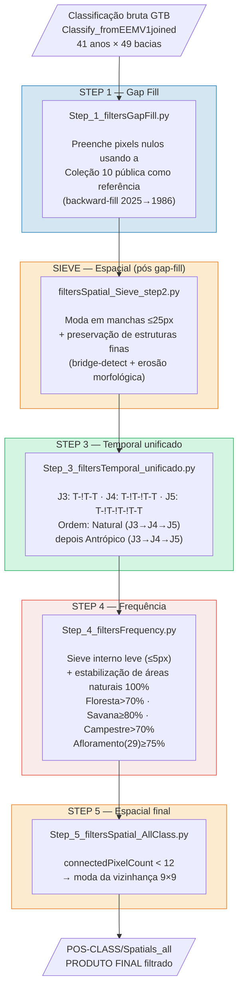

# Pipeline de Pós-Classificação — Filtros Espaciais e Temporais
## MapBiomas Caatinga — Coleção 11

> Documentação **atualizada e fiel ao código atual** (`Step_1`…`Step_5` +
> `filtersSpatial_Sieve_step2.py`). Uma versão anterior deste README descrevia um
> pipeline legado (scripts `filters*_stepNX.py`, janela temporal de 6 anos em
> direção 2025→1985, âncoras C0/C5) que **não corresponde** mais aos scripts
> presentes no diretório. O histórico dessa lógica legada está preservado ao final,
> na seção **"Apêndice — lógica temporal legada"**.

---

## Por que aplicar filtros?

A série temporal de 41 anos (1985–2025) do Landsat é construída a partir de
mosaicos de cenas com diferentes qualidades radiométricas. Mesmo após o
mascaramento de nuvens, a classificação GTB (Gradient Tree Boost) herda ruídos das
imagens brutas:

```
FONTE DO RUÍDO              MANIFESTAÇÃO NA CLASSIFICAÇÃO
──────────────────────────  ──────────────────────────────────────────────
Nuvens residuais            Pixels nulos (gaps) ou erro espectral pontual
Sombras de nuvens           Pixels classificados erroneamente como água/solo exposto
Sombras de relevo           Pixels sistematicamente mascarados em encostas
Aerossol / fumaça seca      Confusão entre classes espectralmente próximas
Scan-line gaps ETM+         Faixas de pixels sem dado (2003+)
Variação fenológica anual   "Blips" temporais em anos com seca/chuva atípicos
```

Os filtros removem esses artefatos em três domínios:

| Domínio | O que remove | Estratégia |
|---------|-------------|------------|
| **Temporal** | Erro de 1–3 anos isolados na série | Varredura por janelas J3/J4/J5 + consistência de vizinhos temporais |
| **Espacial** | Pixels/manchas isolados ("sal e pimenta") | `connectedPixelCount` + moda da vizinhança (com preservação de estruturas finas) |
| **Frequência** | Oscilação em áreas permanentemente naturais | Frequência acumulada dos 41 anos |

---

## Sequência REAL de execução

Rastreada pelos assets de entrada→saída de cada script (todos sob
`projects/mapbiomas-workspace/AMOSTRAS/col11/CAATINGA/POS-CLASS/`):

```
Classify_fromEEMV1joined                       (classificação GTB bruta)
  │  Step_1_filtersGapFill.py
  ▼
POS-CLASS/Gap-fill              filterGF_BACIA_{n}_GTB_V1_7cc
  │  filtersSpatial_Sieve_step2.py           ← filtro espacial efetivo pós-gap-fill
  ▼
POS-CLASS/Spatials_sieve        filterSieve_BACIA_{n}_GTB_V1
  │  Step_3_filtersTemporal_unificado.py     ← J3/J4/J5 natural + antrópico (unificado)
  ▼
POS-CLASS/TemporalAnt           filterTP_BACIA_{n}_GTB_V3_7cc
  │  Step_4_filtersFrequency.py              ← sieve interno leve + frequência
  ▼
POS-CLASS/Frequency             filterFQ_BACIA_{n}_GTB_V3_7cc
  │  Step_5_filtersSpatial_AllClass.py
  ▼
POS-CLASS/Spatials_all          filterSP_BACIA_{n}_GTB_V2_7cc   ← PRODUTO FINAL
```

> **`Step_2_filtersSpatial_By_Cover.py` é um caminho paralelo/alternativo**, não
> encadeado na sequência principal: lê de `Gap-fill` e escreve em `Spatials_int`
> (asset que nenhum outro script consome). Corresponde ao "Spatial_int" da
> sequência histórica, mas o filtro espacial efetivamente usado após o Gap-fill é
> o **Sieve** (`filtersSpatial_Sieve_step2.py`).

Todos operam **por bacia** (49 bacias, campo `nunivotto4`), sobre as 41 bandas
`classification_1985`…`classification_2025`, escala 30 m, `pyramidingPolicy=mode`,
`maxPixels=1e13`. A máscara `bacia_raster` vem de
`reduceToImage(['id_codigo'], Reducer.first()).gt(0)`.

---

## Estrutura de arquivos (real)

```
src/filter/
├── arqParametros.py                    # parâmetros gerais (legado col9, não importado pelos filtros)
├── Step_1_filtersGapFill.py            ★ Gap-fill (preenchimento de gaps via Coleção 10)
├── filtersSpatial_Sieve_step2.py       ★ Sieve espacial c/ preservação de estruturas finas
├── Step_2_filtersSpatial_By_Cover.py   ○ Filtro espacial por cobertura (caminho PARALELO → Spatials_int)
├── Step_3_filtersTemporal_unificado.py ★ Temporal unificado J3/J4/J5 (natural + antrópico)
├── Step_4_filtersFrequency.py          ★ Frequência (com sieve interno leve)
├── Step_5_filtersSpatial_AllClass.py   ★ Filtro espacial final (todas as classes) → produto
└── README_filtros.md                   (este arquivo)
```
★ = etapa da cadeia principal · ○ = caminho paralelo

---

## Fluxograma de execução



---

## Descrição detalhada de cada script

### STEP 1 — `Step_1_filtersGapFill.py`  (Preenchimento de gaps)
Classe `processo_gapfill`.

**Problema:** após o mascaramento de nuvens/sombras muitos pixels ficam sem
classificação. Em séries longas um pixel pode ter dado ausente em vários anos,
sobretudo em encostas com sombra de relevo sistemática.

**Referência externa:** Coleção 10 pública
`projects/mapbiomas-public/.../collection10/mapbiomas_brazil_collection10_integration_v2`
(`year_col10_max = 2023`). O alfabeto de classes é remapeado para 7 classes
(`classMapB → classNew`, `num_clases = 7`).

**Lógica (`applyGapFill`):**
1. **Série corrigida por classe:**
   - `33` (água) só permanece se col10 remapeado ∈ {33, 3}; senão recebe col10.
   - `19` (agricultura) só permanece se col10 ∈ {19, 21, 15}.
   - `36` (lavoura perene) só permanece se col10 ∈ {36, 21, 15}.
2. **Backward-fill (2025→1986):** cada ano com gap é preenchido com o primeiro
   valor não-nulo dos anos **futuros** (`Reducer.firstNonNull`).
   - **2025** (sem futuro): gap preenchido com col10 de 2023.
   - **Anos ≤ 1995 sem futuro:** fallback col10.
   - **1985:** col10 e depois `filled[1986]`.
3. **Correção zero→33:** pixels com valor 0 que a col10 (ou `filled[2024]` em 2025)
   indica como 33 são forçados a 33.

**Parâmetros:**
```python
input_asset  = '.../Classifier/Classify_fromEEMV1joined'   # filtra version==1, id_bacia==nbacia
output_asset = '.../POS-CLASS/Gap-fill'
year_col10_max = 2023
version_input = 1 ; version_output = 1
```
**Asset de saída:** `filterGF_BACIA_{nbacia}_GTB_V1_7cc`.

---

### SIEVE — `filtersSpatial_Sieve_step2.py`  (Filtro espacial c/ preservação de estruturas finas)
Funções `mode_spatial_filter` / `apply_sieve_filter`. **É o filtro espacial
efetivamente encadeado após o Gap-fill** (input `Gap-fill`, output
`Spatials_sieve`).

**Problema:** remover "sal e pimenta" **sem destruir feições lineares finas**
(rios, matas ciliares, corredores) — que o sieve clássico apagaria.

**Parâmetros (`param`):**
```python
native_scale = 30
max_filter_pixels = 25     # manchas com cc ≤ 25 são candidatas à substituição
kernel_size = 9            # raio do focal_mode
max_cc_size = 500          # cap do connectedPixelCount (>> max_filter_pixels)
use_bridge_detect = True
erode_radius = 2
thin_cc_threshold = 50
excessions_class = [33, 29, 25]        # água, afloramento, não-vegetado — nunca substituídas
class_merge_groups = [[15, 21], [4, 12]]   # Pastagem↔Mosaico ; Savana↔Campestre (tratadas como 1 feição)
```

**Lógica (por banda anual):**
1. Funde os grupos de classes (`img_merged`) para o cálculo de conectividade.
2. `connectedPixelCount` em **8-conn** (`connect_1`) e **4-conn** (`connect_2`),
   cap 500 (garante CC real de estruturas lineares longas).
3. **Detecção de ponte** (`is_bridge`): via `neighborhoodToBands(Kernel.square(1))`,
   pixel é ponte se tem vizinhos iguais em ao menos um par de direções opostas
   (H, V, ↗↙, ↖↘). Pontes não são apagadas (`not_bridge`).
4. **Erosão morfológica** (`focal_min`/`focal_max`, `erode_radius=2`) → detecta
   interior compacto; feições com largura < 5 px não têm interior.
5. **Estruturas finas** (`is_thin`): `connect_1 > 50 ∧ ¬compacto` → preservadas
   (rios/matas ciliares).
6. `mode_img = focal_mode(kernel 9)`; aplica moda a manchas `cc ≤ 25 ∧ not_bridge`
   (classe 21 usa 4-conn, mais restrito). Exceções {33,29,25} restauradas.
7. Composição: `img.blend(mode_all).blend(mode_21).blend(thin_layer).blend(exceptions)`.

**Asset de saída:** `filterSieve_BACIA_{nbacia}_GTB_V1`.

---

### STEP 3 — `Step_3_filtersTemporal_unificado.py`  (Temporal unificado J3/J4/J5)
Classe `processo_filterTemporal`. **Substitui, numa única execução, os múltiplos
passos temporais Natural/Antrópico J3/J4/J5** da versão legada.

**Reclassificação binária (só para detectar padrão):** `classMapB → classNat`,
natural=1 {3,4,5,6,9,11,12,13,32,33}, antrópico=0 {15,18,19,20,21,22,23,24,25,26,
29,30,31,36,39,40,41,46,47,48,49,50,62,75}. **O flag identifica a anomalia; a
correção sempre copia a classe REAL do ano-âncora vizinho** (não o flag binário).

**Varredura client-side** (Python for-loops sobre as 41 bandas, evita recursão
excessiva no grafo GEE). Para `target ∈ [1 (natural), 0 (antrópico)]` e
`window ∈ [3, 4, 5]`:

```
J3 — padrão T-!T-T          (1 ano anômalo)
     se flag(bᵢ₋₁)=T ∧ flag(bᵢ)≠T ∧ flag(bᵢ₊₁)=T  →  bᵢ ← bᵢ₋₁

J4 — padrão T-!T-!T-T        (2 anos anômalos consecutivos)
     bordas=T, 2 internos≠T  →  b[i+1] ← b[i] ; b[i+2] ← b[i+3]

J5 — padrão T-!T-!T-!T-T     (3 anos anômalos consecutivos)
     bordas=T, 3 internos≠T  →  b[i+1] ← b[i] ; b[i+2] ← b[i] ; b[i+3] ← b[i+4]
```

**Ordem:** primeiro `natural` (J3→J4→J5), depois `antrópico` (J3→J4→J5); cada
passagem opera sobre o `result` acumulado. "Natural" corrige blips antrópicos
dentro de série natural (seca/nuvem/fenologia); "Antrópico" corrige falsa
regeneração dentro de série antrópica.

**Asset de saída:** `filterTP_BACIA_{nbacia}_GTB_V3_7cc` (metadado `janela=5`,
lido pelo Step 4).

---

### STEP 4 — `Step_4_filtersFrequency.py`  (Frequência, com sieve interno)
Classe `processo_filterFrequence`. Aplica **novamente um sieve** (mais leve) antes
de calcular as frequências.

**Sieve interno** (mesma `mode_spatial_filter`):
```python
max_filter_pixels = 5 ; kernel_size = 3 ; max_cc_size = 100 ; erode_radius = 1
thin_cc_threshold = 10 ; excessions_class = [33, 29]
class_merge_groups = [[3,4,5,9,12,13], [15,18,19,20,21,39,40,41]]
```

**Frequências** (sobre 41 anos): `florest_frequence = eq(3).sum()*100/n`, idem
savana (4), grassland (12), afloramento (29). Máscara natural (`classNat`):
`natural.eq(100)` → pixel natural em **100% dos 41 anos** (`mask_natural`).

**Estabilização** (só onde `mask_natural==1`), aplicada nesta ordem:
```
Campestre (12)   se grassland_frequence > 70
Floresta  (3)    se florest_frequence  > 70
Savana    (4)    se savana_frequence  ≥ 80      ← prevalece (última regra)
```
**Afloramento estático:** `afloramento_map = 29` onde `afloramento_frequence ≥ 75`,
forçado em toda a série.

Aplicação por banda: `imgClassFiltered.blend(vegetation_map).blend(afloramento_map)`.

> Thresholds assimétricos: Floresta é rara na Caatinga (confirmação alta);
> Savana é dominante (≥80% evita generalização excessiva); Campestre >70%.
> (A versão legada deste README dizia "Campestre >60%" — o código usa **>70%**.)

**Asset de saída:** `filterFQ_BACIA_{nbacia}_GTB_V3_7cc`.

---

### STEP 5 — `Step_5_filtersSpatial_AllClass.py`  (Espacial final — todas as classes)
Função `apply_spatialFilterConn`. Filtro de moda simples para todas as classes; é
o **produto final** da cadeia.

```
PASSO 1  n_conn = connectedPixelCount(maxSize=12, eightConnected=True)  (banda _conn)
PASSO 2  maskConn = (n_conn < 12)                              ← pixels isolados
PASSO 3  kernel = ee.Kernel.square(4)   → janela 9×9 (≈270 m)
         filtrado = base.reduceNeighborhood(Reducer.mode(), kernel)
PASSO 4  resultado = base.blend(filtrado.updateMask(maskConn))
```
**Parâmetros:** `min_connect_pixel = 12`, kernel raio 4 (9×9).
**Asset de saída:** `filterSP_BACIA_{nbacia}_GTB_V2_7cc` → `POS-CLASS/Spatials_all`.

---

### STEP 2 (paralelo) — `Step_2_filtersSpatial_By_Cover.py`  (Espacial por cobertura)
Função `apply_spatialFilterConn`. **Não encadeado** na sequência principal
(input `Gap-fill` → output `Spatials_int`).

- `min_connect_pixel = 12`; kernel `ee.Kernel.square(4)` (9×9).
- Máscaras por par de classe: `maskSavUso` = 4∨21; `maskUsoSolo` = 21∨22.
- Redutores: `mode` (Savana↔Uso) e `min` (conservador, favorece a classe de menor
  valor onde o contexto é ambíguo).
- Composição: `base.blend(min…).blend(mode…).blend(min…)`.

> ⚠️ Inconsistência conhecida: o Gap-fill grava `version=1`, mas este script filtra
> por `version==2`.

---

## Resumo visual dos problemas e soluções

```
PROBLEMA           EXEMPLO (série temporal, 1 pixel)            FILTRO
─────────────────  ──────────────────────────────────────────  ─────────────────
Gap (pixel nulo)   4  4  --  --  4  4  3  3  ...                Step 1 (Gap Fill)
Blip antrópico     4  4  21  4  4  4  4  ...  (dentro natural)  Step 3 Natural J3
Falsa regeneração  21 21  4  21 21 21 ...     (dentro antróp.)  Step 3 Antrópico J3
Anomalia 2–3 anos  3  3  21 21  3  3 ...                        Step 3 J4/J5
Sal-e-pimenta      vizinhos B B B, pixel A isolado             Sieve / Step 5
Rio fino           feição linear de 1–2 px de largura          Sieve (preservada)
Oscilação em área  freq_natural=100% e savana≥80% → fixado     Step 4 (Frequência)
permanente natural
```

---

## Execução

Os scripts de filtro **não recebem argumentos de fatiamento** — iteram
internamente sobre `listaNameBacias` (49 bacias):

```bash
cd src/filter/
python Step_1_filtersGapFill.py
python filtersSpatial_Sieve_step2.py
python Step_3_filtersTemporal_unificado.py
python Step_4_filtersFrequency.py
python Step_5_filtersSpatial_AllClass.py
```

Flags de controle internas:
- `knowMapSaved=True` → apenas varre o asset de saída e reporta bacias faltantes.
- `changeAcount=True` → ativa o rodízio de contas via `gerenciador(cont)`
  (`switch_user` + `ee.Initialize`), gravando `relatorioTaskXContas.txt`
  (`numeroTask=6`). Frequentemente a chamada está comentada → roda na conta
  corrente (`get_current_account()`).

Metadados comuns gravados: `version, biome=CAATINGA, collection=11.0, id_bacias,
sensor=Landsat, source=geodatin, model=GTB, num_class, type_filter`.

---

## ⚠️ Inconsistências de `version` a conferir antes de rodar a cadeia completa

| Transição | Grava | Próximo script lê | OK? |
|---|---|---|---|
| Gap-fill → Sieve | V1 | V1 | ✅ |
| Sieve → Step_3 | V1 | **V3** | ⚠️ conferir |
| Step_3 → Step_4 | V3 | V3 | ✅ |
| Step_4 → Step_5 | V3 | **V2** | ⚠️ conferir |
| Gap-fill → Step_2 (paralelo) | V1 | **V2** | ⚠️ conferir |

Além disso: o Gap-fill usa a propriedade `id_bacia` (sem "s"), enquanto os demais
usam `id_bacias` — armadilha conhecida na filtragem das coleções.

---

## Etapas POS-CLASS sem script no repositório

Os assets `POS-CLASS/TemporalbyCC`, `EstabilidadeCols`, `correcoes`, `toExport`,
`layer_rios_finos` e `layer_afloramento` são **consumidos** pelos visualizadores
(`src/show_mapas/*.js`) e pela exportação final
(`src/utieis_scripts/exportarclassFinaltoMapbiomasJo_emergV2.py`), mas os scripts
que os **produzem não estão presentes** neste diretório (apenas o teste
`test_rios_finos_layer.js`). A **detecção de estradas (classe 25)** citada no
`CLAUDE.md` também **não possui código** no repositório.

---

## Apêndice — lógica temporal legada (histórico, NÃO corresponde ao código atual)

> Mantido apenas como referência histórica. O `Step_3_filtersTemporal_unificado.py`
> atual **não** usa janela de 6 anos, direção inversa 2025→1985, nem âncoras C0/C5.
> A implementação atual está descrita na seção do STEP 3 acima.

A versão anterior aplicava filtros temporais em **passos separados** (Natural J6 →
Antrópico J5 → Natural J3/J4), iterando a série em **ordem inversa (2025→1985)**,
com `C0` como âncora futura já processada e o último elemento da janela como âncora
passada. Regras por janela:

```
Janela 6 (Natural, 1ª passagem):  C0=1 ∧ C5=1  →  C1..C4 corrigidos
Janela 5 (Natural/Antrópico):     C0=X ∧ C4=X ∧ C1,C2,C3≠X  →  C1..C3 corrigidos
Janela 4:                         C0=X ∧ C3=X ∧ C1,C2≠X      →  C1,C2 corrigidos
Janela 3 (conservadora):          C0=X ∧ C2=X                →  C1 corrigido
```
Anos nunca corrigidos (adicionados diretos de `imgClass`): 2025 (borda futura) e
1985 (borda passada). Armadilha documentada: ao reconstruir `maps_bacias_c` no
penúltimo `cc` ativo era obrigatório incluir o tail `lstbandsInv[cc+delta:]`, sob
pena de `classification_1985` desaparecer antes das duas últimas janelas.
Assets legados: `TemporalA` (natural), `Temporal` (antrópico), `TemporalCC`
(produto final).

---

*Produzido por Geodatin — Dados e Geoinformação | MapBiomas Caatinga Coleção 11*
